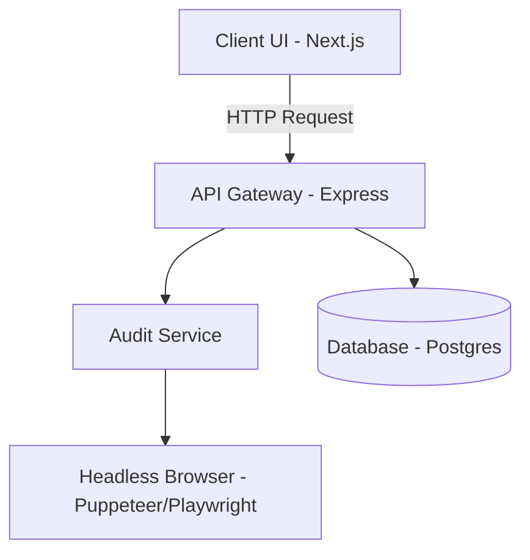

# PagePulse

PagePulse is a modern, full-stack application designed to perform rapid, comprehensive audits on any given web page. 

## Architecture Overview



## Tech Stack

| Component | Technology |
|---|---|
| Frontend | Next.js, React, Tailwind CSS |
| Backend | Node.js, Express, TypeScript |
| Shared Types | Zod, TypeScript |
| Testing | Playwright, Jest |
| Monorepo | pnpm, Turborepo |

## Local Setup

1. **Install Dependencies:**
   ```bash
   pnpm install
   ```

2. **Run Development Servers:**
   ```bash
   pnpm run dev
   ```

## Environment Variables

| Variable | Description | Required |
|---|---|---|
| `NEXT_PUBLIC_API_URL` | URL of the backend API | Yes |
| `PORT` | Port for the backend service | No |
| `NODE_ENV` | Environment (e.g. development, production) | No |

## API Documentation
- [Audit Request Types](./packages/shared-types/src/schemas/audit-request.ts)
- [Audit Response Types](./packages/shared-types/src/schemas/audit-response.ts)

## Design Decisions
1. **Monorepo Architecture (pnpm + Turborepo):** Enables seamless code sharing (like Zod schemas) between frontend and backend, ensuring end-to-end type safety and reducing duplication.
2. **Zod for Schema Validation:** Used for runtime validation and static type inference. Guarantees that data crossing network boundaries matches expected structures.
3. **Playwright for E2E Tests:** Provides reliable, cross-browser testing capabilities out of the box, essential for verifying our audit flow accurately.

## Deploy Guide
Deployment is orchestrated via Docker. Use `docker-compose up --build` for simple deployments, or deploy the individual Dockerfiles (`apps/frontend/Dockerfile`, `apps/backend/Dockerfile`) to your cloud provider of choice (e.g., AWS ECS, Vercel for frontend, Render for backend).
