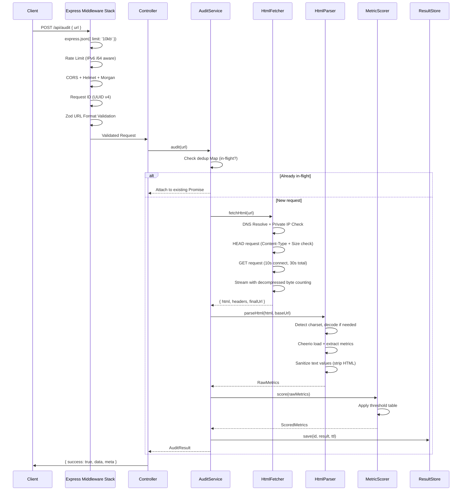

# Architecture Review: PagePulse Pro

**Reviewer**: Senior Staff Engineer
**Date**: 2026-07-25
**Status**: Review Complete — Final Approved Architecture Below
**Scope**: Full architecture review of all 13 design documents

---

## Executive Summary

The PagePulse Pro architecture is fundamentally sound for an MVP SEO audit tool. The monorepo structure, technology choices, and separation of concerns are well-reasoned. However, this review identifies **14 weaknesses**, **5 cases of over-engineering**, **9 missing edge cases**, **6 performance concerns**, **7 security gaps**, **4 maintainability issues**, and **3 DX problems** that must be addressed before implementation begins.

The revised architecture below incorporates all fixes while maintaining the project's core principle: simplicity.

---

## 1. Weaknesses Identified

### W-1: In-Memory Store Data Loss Is Underspecified
**Document**: ADR-010, Backend Architecture
**Issue**: The in-memory Map store loses all shareable results on every Render deploy or process restart. With Render's free tier restarting on every push and sleeping after 15 minutes of inactivity, shareable links will have extremely poor reliability.
**Impact**: High — shareable links are a core feature per the PRD.
**Fix**: Add an explicit degradation strategy. The in-memory store should implement a `StorageAdapter` interface so Redis or SQLite can be swapped in without touching service code. Document the expected data loss in the UI (e.g., "Links expire after 24 hours or sooner").

### W-2: Loading Stage Simulation Is Fragile
**Document**: Frontend Architecture, UI Design
**Issue**: The loading stages (Connecting → Downloading → Parsing → Analyzing → Generating) are client-side simulations with hardcoded time windows (0-2s, 2-4s, etc.) while the actual backend request is a single blocking call. If the backend responds in 800ms, the UI will still show fake stages for 7 seconds. If it takes 25 seconds, all stages will have completed long before the response arrives.
**Impact**: Medium — breaks user trust if obviously fake.
**Fix**: Use a two-phase approach: (1) Show an indeterminate progress animation for the first 500ms, (2) Use time-based stage transitions that accelerate when the response arrives. Set the final "Generating" stage to trigger on actual response receipt, not on a timer. Add a `minDisplayTime` (e.g., 2 seconds total) to prevent jarring instant transitions.

### W-3: Backend Architecture Document Lacks Depth
**Document**: Backend Architecture
**Issue**: At 105 lines, this is the thinnest document in the suite. It repeats the original spec bullet points verbatim without adding architectural depth. Compare to Frontend Architecture (146 lines with diagrams) or ADR (263 lines). Critical details are missing: how does the MetricScorer work? What are the scoring thresholds? How does the result store integrate?
**Impact**: Medium — developers will have to make undocumented decisions.
**Fix**: Expand with: scoring threshold tables (title length 30-60 = green, <30 or >60 = amber, missing = red), result store lifecycle diagram, MetricScorer algorithm description, graceful degradation for partial metric failures.

### W-4: No Graceful Shutdown Handling
**Document**: Backend Architecture, Environment Configuration
**Issue**: No mention of SIGTERM/SIGINT handling. On Render, containers receive SIGTERM before shutdown. Without graceful shutdown, in-flight audit requests will be dropped mid-execution.
**Impact**: Medium — poor reliability under deployments.
**Fix**: Add graceful shutdown procedure: stop accepting new connections, wait for in-flight requests (max 10s), flush logs, then exit. Document in Backend Architecture.

### W-5: API Documentation Missing Request Validation Details
**Document**: API Documentation
**Issue**: The validation rules say "no private IPs" but don't specify how this works. When does IP resolution happen — at validation time or fetch time? DNS resolution at validation creates a TOCTOU (time-of-check-time-of-use) vulnerability. The URL could resolve to a public IP during validation but a private IP during fetch.
**Impact**: High — SSRF vulnerability.
**Fix**: Validate URL format at the validation layer. Perform DNS resolution + private IP check at the fetch layer, just before opening the connection. Document this two-phase validation in both API docs and Backend Architecture.

### W-6: Missing `User-Agent` Header Strategy
**Document**: Backend Architecture, API Documentation
**Issue**: The HTML fetcher doesn't specify a User-Agent header. Many websites block requests without a User-Agent, return different content to bots, or serve CAPTCHA pages. This will cause silent failures for a significant percentage of audited URLs.
**Impact**: High — core functionality degradation.
**Fix**: Send a descriptive User-Agent: `PagePulse/1.0 (+https://pagepulse.app/bot)`. Add a `robotsTxtCompliance` flag to optionally respect robots.txt (default: off, since we're a user-initiated tool, not a crawler). Document the decision.

### W-7: Missing Content-Type Verification Before Parsing
**Document**: Error Handling, Backend Architecture
**Issue**: The error handling table mentions `NOT_HTML` (415) but doesn't specify *when* content-type is checked. If we download the full 10MB body before checking Content-Type, we've already wasted resources.
**Impact**: Medium — resource waste.
**Fix**: Check the `Content-Type` response header immediately after receiving the HTTP headers but before consuming the body. Abort the request if Content-Type is not `text/html` or `application/xhtml+xml`.

### W-8: No Request Deduplication
**Document**: Backend Architecture, API Documentation
**Issue**: If 10 users audit `https://example.com` simultaneously, the backend makes 10 identical HTTP requests. This wastes resources and may trigger rate limiting on the target server.
**Impact**: Low-Medium — resource efficiency.
**Fix**: Implement request coalescing: if an audit for the same URL is already in-flight, attach subsequent requests to the same promise. Use a simple `Map<string, Promise<AuditResult>>` that is cleared on resolution.

### W-9: PRD Missing Metric Scoring Thresholds
**Document**: PRD
**Issue**: The PRD says "color-coded scoring (green/amber/red thresholds)" but never defines what those thresholds are. This is a functional requirement that's underspecified.
**Impact**: Medium — ambiguity in implementation.
**Fix**: Add a scoring threshold table to the PRD:

| Metric | Green | Amber | Red |
|--------|-------|-------|-----|
| Title Length | 30-60 chars | 15-29 or 61-70 chars | Missing or <15 or >70 chars |
| Meta Description Length | 120-160 chars | 70-119 or 161-200 chars | Missing or <70 or >200 chars |
| H1 Count | Exactly 1 | 2-3 | 0 or >3 |
| Images Missing Alt | 0 | 1-3 | >3 |
| Word Count | 300+ | 100-299 | <100 |
| Canonical URL | Present | — | Missing |
| Robots Meta | Indexable | — | Noindex |

### W-10: Environment Config Rate Limit Defaults Are Inconsistent
**Document**: Environment Configuration
**Issue**: Dev default is `RATE_LIMIT_MAX=100` but the PRD specifies 30 req/min. The production value is also documented as 30. Having different defaults in dev vs prod means developers won't catch rate-limiting bugs locally.
**Impact**: Low — developer confusion.
**Fix**: Use the same default (30) in all environments. Developers can override locally if needed.

### W-11: Engineering Standards Conflict on API Route Naming
**Document**: Engineering Standards
**Issue**: Standards say "noun-based, plural where appropriate (e.g., `/api/audits`)" but every other document uses `/api/audit` (singular). The actual API endpoint should be `POST /api/audit` (action = "create one audit", not "operate on a collection").
**Impact**: Low — naming confusion.
**Fix**: Clarify in Engineering Standards: use singular nouns for action-oriented endpoints (`POST /api/audit`), plural for collection endpoints (`GET /api/audits`). Since we don't have collection endpoints, singular is correct.

### W-12: No Monitoring or Observability Strategy
**Document**: All documents
**Issue**: No mention of monitoring, alerting, health check intervals, or uptime tracking. Morgan logs are insufficient for production observability.
**Impact**: Medium — blind in production.
**Fix**: Add a lightweight observability section: Render health check endpoint polling (already have `GET /health`), structured JSON logs shipped to Render's log aggregation, frontend error tracking via `error.tsx` + optional Sentry integration. Keep it simple but document it.

### W-13: Mermaid Sequence Diagram Syntax Issues
**Document**: Frontend Architecture
**Issue**: The data flow sequence diagram uses participant names with spaces and parentheses (`AuditForm (UI)`, `useAudit (Hook)`) which will break in many Mermaid renderers.
**Impact**: Low — documentation rendering.
**Fix**: Use quoted labels: `participant AF as "AuditForm (UI)"`.

### W-14: Missing `HEAD` Request Optimization
**Document**: Backend Architecture
**Issue**: The fetcher always does a full `GET` request. For content-type and size checks, a `HEAD` request first would avoid downloading non-HTML or oversized content entirely.
**Impact**: Medium — performance optimization.
**Fix**: Consider a two-step fetch: `HEAD` first to check Content-Type and Content-Length, then `GET` if valid. However, some servers don't support `HEAD` properly, so fall back to `GET` with streaming + early abort. Document the tradeoff.

---

## 2. Over-Engineering Identified

### OE-1: `develop` Branch Is Unnecessary
**Document**: Git Strategy
**Issue**: For a solo/small-team MVP, a `develop` integration branch adds merge overhead without value. GitHub Flow (feature branches → main) is simpler and sufficient.
**Recommendation**: Drop `develop`. Use `main` + feature branches. Add branch protection rules to `main` (require passing CI).

### OE-2: Two Docker Compose Files
**Document**: Repository Structure
**Issue**: `docker-compose.yml` and `docker-compose.prod.yml` for a project that deploys to PaaS (Vercel + Render) where Docker Compose is never used in production.
**Recommendation**: Keep one `docker-compose.yml` for local development only. Production uses platform-native deployment. The `Dockerfile` in each app is sufficient for Render.

### OE-3: TanStack Query May Be Overkill
**Document**: Tech Stack Review, Frontend Architecture
**Issue**: PagePulse Pro has exactly ONE mutation (submit audit) and ONE query (fetch shared result). TanStack Query adds 13KB gzipped for caching, deduplication, and retry logic that a single `fetch` call with `useState` could handle. The shared result page is an RSC that doesn't even need client-side data fetching.
**Recommendation**: **Conditional approval**. Start with plain `fetch` + `useState` in the audit form mutation. If complexity grows (polling, multiple endpoints), add TanStack Query later. This saves bundle size and cognitive overhead. Mark as "Conditional" in the approved stack.

### OE-4: Separate `lib/` and `utils/` Directories in Frontend
**Document**: Repository Structure
**Issue**: Having both `lib/` (third-party integrations) and `utils/` (utility functions) creates ambiguity about where code belongs. For a project this size, one `lib/` folder is sufficient.
**Recommendation**: Merge into `lib/`. Use `lib/utils.ts` for utility functions (shadcn/ui convention) and `lib/api.ts` for API client.

### OE-5: Separate `types/` Directory in Frontend
**Document**: Repository Structure
**Issue**: The frontend has a `types/` directory, but shared types come from `@pagepulse/shared-types` and component-specific types should be co-located. A standalone `types/` folder invites orphaned type files.
**Recommendation**: Remove `types/` directory. Co-locate types with their consumers. Use `@pagepulse/shared-types` for shared types.

---

## 3. Missing Edge Cases

### EC-1: Internationalized Domain Names (IDN)
URLs with non-ASCII characters (e.g., `https://例え.jp`) need Punycode conversion before fetching. Axios may or may not handle this automatically.
**Fix**: Add explicit Punycode normalization in the URL validator.

### EC-2: Fragment-Only URLs
A user might enter `#section` or `example.com` (no scheme). The Zod validator should normalize URLs: prepend `https://` if no scheme is provided.
**Fix**: Add URL normalization before validation.

### EC-3: Extremely Slow DNS Resolution
DNS resolution can take 30+ seconds for certain domains, eating into the connect timeout. The 10s connect timeout might not account for DNS time separately.
**Fix**: Set explicit DNS resolution timeout (5s) within the overall 10s connect timeout using a `dns.lookup` with timeout.

### EC-4: Compressed Responses
Many servers respond with `Content-Encoding: gzip` or `br`. The 10MB size limit should apply to the *decompressed* content, not the compressed transfer size. Axios decompresses by default, but the `maxContentLength` check happens on the compressed stream.
**Fix**: Track decompressed bytes during streaming and abort if threshold is exceeded.

### EC-5: Meta Refresh Redirects
HTML `<meta http-equiv="refresh">` redirects won't be caught by Axios's redirect limit since they happen at the HTML level, not HTTP level.
**Fix**: After parsing, check for meta refresh tags and note them in the audit results (don't follow them, just report).

### EC-6: Multiple Canonical URLs
Some pages have conflicting canonical URLs (one in `<link>` tag, one in HTTP header). The parser should handle both and report conflicts.
**Fix**: Check both `Link` HTTP header and `<link rel="canonical">` HTML tag. Report if they conflict.

### EC-7: Empty HTML Response
A server returning a 200 OK with an empty body should be handled gracefully, not crash the parser.
**Fix**: Add empty body check before Cheerio parsing. Return all metrics as "missing" with a warning.

### EC-8: Charset Detection
Pages may use non-UTF-8 encodings (e.g., ISO-8859-1, Shift_JIS). Cheerio defaults to UTF-8, which may garble text for non-UTF-8 pages.
**Fix**: Detect charset from `Content-Type` header and `<meta charset>` tag. Pass to Cheerio's `decodeEntities` option. Add `iconv-lite` as a conditional dependency.

### EC-9: Rate Limiter Behind Reverse Proxy
When behind a reverse proxy (Render's load balancer), `req.ip` may be the proxy's IP, not the client's. All users would share one rate limit bucket.
**Fix**: Configure `app.set('trust proxy', 1)` in Express when behind Render's proxy. Use `X-Forwarded-For` header. Document this in Environment Configuration.

---

## 4. Performance Concerns

### P-1: Cheerio Memory Usage on Large Documents
Cheerio loads the entire DOM into memory. A 10MB HTML file will create a DOM tree consuming 30-50MB of RAM. On Render's free tier (512MB RAM), this is significant.
**Fix**: Consider lowering the HTML size limit to 5MB. Add memory usage monitoring. For very large pages, extract metrics via streaming regex (htmlparser2 events) instead of full DOM loading.

### P-2: No Connection Pooling for Axios
Each audit creates a new TCP connection. Under load, this causes TCP port exhaustion and increased latency.
**Fix**: Configure Axios with a persistent HTTP agent: `new http.Agent({ keepAlive: true, maxSockets: 10 })`.

### P-3: Cold Start on Render Free Tier
Render's free tier sleeps after 15 minutes of inactivity. Cold starts take 30-60 seconds. The first user will experience a very slow response.
**Fix**: Document this limitation prominently. Consider a simple cron ping every 14 minutes during business hours (via UptimeRobot or similar free service). Add a frontend-side "warming up" state if the health check fails.

### P-4: Zod Bundle Size in Frontend
Zod is ~13KB gzipped. If used only for form validation (one schema), this is heavy. `@hookform/resolvers/zod` adds more.
**Fix**: Use the same Zod schema for consistency (shared-types), but ensure tree-shaking is working. Consider dynamic import of the Zod resolver only when the form mounts.

### P-5: Font Loading Strategy Unspecified
Inter font from Google Fonts can block rendering if loaded synchronously.
**Fix**: Use `next/font/google` with `display: 'swap'` and `subsets: ['latin']` for optimal loading. This is built into Next.js and eliminates layout shift.

### P-6: No Response Caching for Shared Results
`GET /api/audit/:id` returns the same immutable result every time but sets no cache headers.
**Fix**: Add `Cache-Control: public, max-age=3600, immutable` to shared result responses. They're immutable once created.

---

## 5. Security Gaps

### S-1: SSRF via DNS Rebinding (Underspecified)
**Document**: Backend Architecture mentions "DNS rebinding protection" but doesn't explain the mechanism.
**Fix**: Resolve DNS before connecting. Check the resolved IP against private ranges. Pin the resolved IP for the actual connection (prevent re-resolution to a different IP). Use Axios's `lookup` option to inject a custom DNS resolver.

### S-2: Open Redirect via Shareable Links
If the `id` parameter in `/audit/[id]` isn't validated, an attacker could craft malicious URLs. While the page only displays audit data, XSS through stored results is possible if metric values (like `<title>`) are rendered without sanitization.
**Fix**: Sanitize all metric values before storage and before rendering. Use React's default JSX escaping (automatic). On the backend, strip HTML tags from extracted text values.

### S-3: No Request Body Size Limit
Express doesn't limit JSON body size by default. An attacker could send a 100MB JSON body to `POST /api/audit`.
**Fix**: Add `express.json({ limit: '10kb' })` — the audit request body should never exceed a few hundred bytes.

### S-4: Missing `X-Content-Type-Options` on API Responses
Helmet sets this by default, but it should be explicitly verified. Without it, browsers might MIME-sniff JSON responses.
**Fix**: Verify Helmet defaults include `X-Content-Type-Options: nosniff`. Add to the security checklist.

### S-5: Rate Limiter Bypass via IPv6
If the server supports IPv6, an attacker with a /64 block has 2^64 unique IPs, making IP-based rate limiting useless.
**Fix**: Rate limit by /64 prefix for IPv6 addresses. Configure `express-rate-limit` with a custom `keyGenerator` that normalizes IPv6 to /64.

### S-6: Stored XSS via Audit Results
The in-memory store saves raw HTML-extracted values. If the `<title>` of a malicious page contains `<script>alert(1)</script>`, this could be stored and rendered in the shared result page.
**Fix**: HTML-encode all extracted text values at the parser level before storing. Use `he` library or Cheerio's `.text()` (which strips HTML) consistently.

### S-7: Missing CORS Preflight Cache
Without `Access-Control-Max-Age`, browsers send a preflight OPTIONS request before every POST. This doubles the latency for every audit.
**Fix**: Set `Access-Control-Max-Age: 86400` in CORS configuration.

---

## 6. Maintainability Issues

### M-1: No Error Code Registry
Error codes are defined in error handling docs but there's no single source of truth file. If a developer adds a new error code, they might not update the docs.
**Fix**: Define all error codes in `packages/shared-types/src/schemas/error-codes.ts` as a Zod enum. Both backend and frontend import from this single source.

### M-2: Test Strategy Doesn't Mention Snapshot Testing
For the 7 metric cards, snapshot tests would catch unintended UI regressions quickly.
**Fix**: Add snapshot testing for MetricCard component with various score states (green/amber/red/missing).

### M-3: No API Versioning Strategy
If the response shape ever changes, existing shared links will break.
**Fix**: Version results in the store with a schema version number. The `GET /api/audit/:id` endpoint should handle schema migration or return a "result format outdated" warning.

### M-4: Missing Dependency Update Strategy
21 dependencies with no mention of how to keep them updated.
**Fix**: Add Renovate or Dependabot configuration. Pin major versions in package.json. Run `pnpm audit` in CI.

---

## 7. Developer Experience Issues

### DX-1: No Local Development Quick Start
The roadmap assumes developers know how to set up pnpm workspaces and Turborepo. There's no single command to get started.
**Fix**: Root `package.json` should have a `dev` script: `turbo dev`. Add a "Getting Started in 60 Seconds" section to README.

### DX-2: No Mock Server for Frontend Development
Frontend development (M7-M9) can't test against real data until M10 (integration). Developers will be coding blind.
**Fix**: Add an MSW (Mock Service Worker) setup in the frontend for development. Create mock responses matching the shared types. This enables frontend development in parallel with backend.

### DX-3: No IDE Configuration
No `.vscode/settings.json` or `.vscode/extensions.json` for consistent editor experience.
**Fix**: Add `.vscode/` with recommended extensions (ESLint, Prettier, Tailwind CSS IntelliSense) and workspace settings (format on save, default formatter).

---

## 8. Final Approved Architecture

After incorporating all fixes above, here is the approved architecture:

### Approved Technology Stack

| Technology | Version | Category | Status | Notes |
|:---|:---|:---|:---|:---|
| Next.js | 15.x | Frontend Framework | ✅ Approved | |
| TypeScript | 5.x | Language | ✅ Approved | |
| Tailwind CSS | 4.x | Styling | ✅ Approved | Use v4 (latest) |
| shadcn/ui | Latest | UI Components | ✅ Approved | |
| React Hook Form | 7.x | Form Management | ✅ Approved | |
| Zod | 3.x | Schema Validation | ✅ Approved | |
| TanStack Query | 5.x | Data Fetching | ⚠️ Conditional | Defer until complexity warrants it; start with fetch + useState |
| Lucide Icons | Latest | Iconography | ✅ Approved | |
| Express | 4.x | Backend Framework | ✅ Approved | |
| Axios | 1.x | HTTP Client | ✅ Approved | Configure with persistent Agent |
| Cheerio | 1.x | HTML Parsing | ✅ Approved | |
| Helmet | 7.x | Security | ✅ Approved | |
| CORS | 2.x | Security | ✅ Approved | Add `maxAge: 86400` |
| Morgan | 1.x | Logging | ✅ Approved | |
| express-rate-limit | 7.x | Security | ✅ Approved | Add IPv6 /64 key generator |
| Vitest | Latest | Unit Testing | ✅ Approved | |
| Supertest | Latest | API Testing | ✅ Approved | |
| Turborepo | Latest | Build System | ✅ Approved | |
| pnpm | 9.x | Package Manager | ✅ Approved | |
| Docker | Latest | Containerization | ✅ Approved | Single compose file |
| Playwright | Latest | E2E Testing | ✅ Approved | |
| MSW | Latest | Mock Server | ✅ Added | Frontend dev mocking |

### Approved Repository Structure Changes

```diff
  pagepulse-pro/
  ├── apps/
  │   ├── frontend/
+ │   │   ├── mocks/                 # MSW handlers for development
- │   │   ├── lib/                   # REMOVED (merged into utils)
- │   │   ├── types/                 # REMOVED (co-locate with consumers)
  │   │   └── ...
  │   └── backend/
+ │       └── src/
+ │           ├── store/
+ │           │   ├── storage-adapter.ts    # Interface
+ │           │   ├── memory-store.ts       # In-memory implementation
+ │           │   └── result-store.ts       # Store orchestrator
  │           └── ...
- ├── docker-compose.prod.yml        # REMOVED
+ ├── .vscode/                       # IDE configuration
+ │   ├── settings.json
+ │   └── extensions.json
  └── ...
```

### Approved Backend Request Flow (Revised)



### Approved Scoring Thresholds

| Metric | 🟢 Green | 🟡 Amber | 🔴 Red |
|:---|:---|:---|:---|
| Title | Present, 30-60 chars | Present, <30 or >60 chars | Missing |
| Meta Description | Present, 120-160 chars | Present, <120 or >160 chars | Missing |
| H1 Count | Exactly 1 | 2-3 | 0 or >3 |
| Images Missing Alt | 0 | 1-3 | >3 |
| Word Count | ≥300 | 100-299 | <100 |
| Canonical URL | Present | — | Missing |
| Robots Meta | Indexable | — | Noindex |

### Approved Error Handling Additions

Add to the error handling system:

| Error Scenario | Error Code | HTTP Status | Recovery |
|:---|:---|:---|:---|
| Empty HTML body | `EMPTY_RESPONSE` | 502 | Prompt retry |
| Charset decode failure | `ENCODING_ERROR` | 502 | Report as warning |
| Request body too large | `PAYLOAD_TOO_LARGE` | 413 | Reduce request size |

### Approved Git Strategy Changes

```diff
- main ← develop ← feature branches
+ main ← feature branches (GitHub Flow)
```

Drop the `develop` branch. Use branch protection on `main` with required CI checks.

### Approved Security Checklist

Before every release, verify:

- [ ] `express.json({ limit: '10kb' })` is set
- [ ] `app.set('trust proxy', 1)` is configured for Render
- [ ] DNS resolution + private IP check happens at fetch time (not validation time)
- [ ] Rate limiter uses IPv6 /64 prefix normalization
- [ ] All extracted text values are HTML-sanitized before storage
- [ ] Helmet defaults are active (verify with `curl -I`)
- [ ] CORS origin is exact match (no wildcards)
- [ ] User-Agent header is set on outgoing requests
- [ ] `Content-Type` is checked before downloading body
- [ ] Graceful shutdown handler is registered for SIGTERM

### Approved Performance Checklist

- [ ] Axios uses persistent HTTP Agent (`keepAlive: true`)
- [ ] `Cache-Control` headers set on `GET /api/audit/:id`
- [ ] `next/font/google` used for Inter with `display: 'swap'`
- [ ] HTML size limit: 5MB (reduced from 10MB for memory safety)
- [ ] Frontend bundle < 200KB gzipped (audit with `next build --analyze`)
- [ ] Zod dynamically imported in client components if possible

---

## 9. Verdict

> **Architecture Status: APPROVED WITH MODIFICATIONS**

The architecture is approved for implementation with the modifications listed above. The core design is sound — the monorepo structure, technology choices, separation of concerns, and error handling model are all well-reasoned for an MVP.

The most critical items to address before coding begins:

1. **S-1**: SSRF DNS rebinding — resolve DNS at fetch time, not validation time
2. **S-3**: Add request body size limit (`10kb`)
3. **S-6**: Sanitize extracted text to prevent stored XSS
4. **W-1**: Make the storage layer pluggable via `StorageAdapter` interface
5. **W-2**: Fix the loading stage simulation to respond to actual timing
6. **W-6**: Add User-Agent header to outgoing requests
7. **EC-9**: Configure `trust proxy` for rate limiting behind Render's proxy

All other items are important but can be addressed during implementation milestones.

---

*Review completed 2026-07-25 by Senior Staff Engineer*
