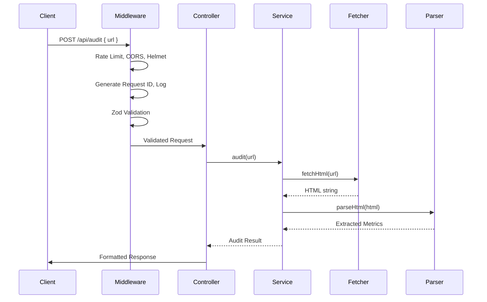
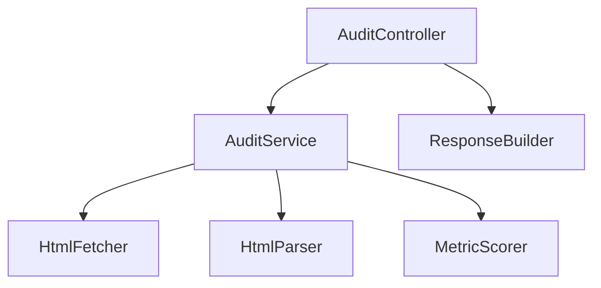

# Backend Architecture

## Request Flow
Client → Rate Limiter → CORS → Helmet → Morgan Logger → Request ID Middleware → Zod Validation Middleware → Controller → Service → Parser → Response Builder → Client

## Validation Layer
- Zod schema validates request body
- URL format validation (must be http/https)
- Block localhost, private IPs (10.x, 172.16-31.x, 192.168.x), link-local (169.254.x)
- Block javascript:, ftp:, data: schemes
- Max URL length: 2048 characters
- DNS rebinding protection

## Controller Layer
- Thin HTTP handler, delegates to service
- Extracts validated data from request
- Calls `AuditService.audit(url)`
- Formats response using `ResponseBuilder`

## Service Layer
- `AuditService` class (pure, no Express dependencies)
- `fetchHtml(url)`: Axios GET with 10s connect timeout, 30s total timeout, max 5 redirects, 10MB response limit, AbortController
- `parseHtml(html, baseUrl)`: Cheerio load, extract all metrics
- `audit(url)`: orchestrates fetch → parse → score → format

## Parser Layer
- Cheerio-based HTML parsing
- Extract: title text, meta description content, h1 elements count, img elements without alt, word count (strip script/style/hidden, normalize whitespace), canonical link, robots meta content
- Word count normalization: remove script tags, style tags, hidden elements, normalize whitespace, split on word boundaries

## Utilities
- URL validator (`isValidUrl`, `isPrivateIP`, `isBlockedScheme`)
- `ResponseBuilder` (success/error factory methods)
- RequestID generator (UUID v4)
- Logger (structured JSON logs in production, pretty in dev)

## Response Builder
- Success: `{ success: true, data: AuditResponse, meta: { requestId, timestamp, duration } }`
- Error: `{ success: false, error: { code: string, message: string }, meta: { requestId, timestamp } }`

## Error Handler
- Global Express error handler
- Maps `AppError` subclasses to HTTP status codes
- Strips stack traces in production
- Logs full error details server-side
- Returns sanitized error to client

## Configuration
- Environment variables validated by Zod schema
- `PORT`, `NODE_ENV`, `CORS_ORIGIN`, `RATE_LIMIT_MAX`, `RATE_LIMIT_WINDOW_MS`
- Fail fast on invalid config at startup

## Logging
- Morgan for HTTP request logging
- Custom logger for application events
- Structured JSON in production, human-readable in development
- Request ID correlation

## Testing Strategy
- Unit: Zod validators, URL validation, HTML parsing, metric extraction, error mapping
- Integration: POST /api/audit with mocked Axios responses
- Fixtures: sample HTML files for parser tests

## Dependency Flow
Controller → AuditService → { HtmlFetcher, HtmlParser, MetricScorer }
All services receive dependencies via constructor injection for testability.

## Diagrams

### Request Flow

### Dependency Graph

