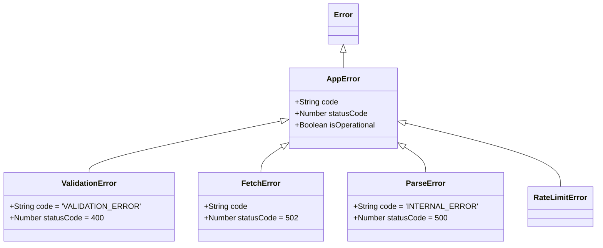

# Error Handling System

## Error Scenarios

| Error Scenario | Error Code | HTTP Status | Frontend User Message | Developer Message | Recovery Strategy |
| --- | --- | --- | --- | --- | --- |
| Invalid URL format | `INVALID_URL` | 400 | "Please enter a valid website URL starting with http:// or https://." | "Validation failed: URL format is incorrect." | Prompt user to correct input. |
| Blocked URL | `BLOCKED_URL` | 400 | "This URL cannot be audited for security reasons." | "Validation failed: URL resolves to private IP or blocked scheme." | None. Block action. |
| Connection timeout (10s) | `FETCH_TIMEOUT` | 408 | "The website took too long to connect. Please try again later." | "Axios connect timeout (10s) exceeded." | Offer retry button. |
| Response timeout (30s) | `FETCH_TIMEOUT` | 408 | "The website took too long to respond. Please try again later." | "Axios response timeout (30s) exceeded." | Offer retry button. |
| DNS resolution failure | `DNS_FAILURE` | 502 | "We couldn't find this website. Please check the spelling." | "ENOTFOUND or EAI_AGAIN during DNS resolution." | Prompt user to check URL. |
| SSL/TLS error | `SSL_ERROR` | 502 | "The website has a security certificate issue." | "UNABLE_TO_VERIFY_LEAF_SIGNATURE or similar SSL error." | None. |
| Redirect loop (>5) | `REDIRECT_LOOP` | 502 | "The website has too many redirects." | "Max redirects (5) exceeded." | None. |
| Target returns 404 | `NOT_FOUND` | 502 | "The page was not found on the target website." | "Upstream returned 404." | Prompt user to check URL. |
| Target returns 500 | `UPSTREAM_ERROR` | 502 | "The target website is experiencing technical difficulties." | "Upstream returned 500." | Offer retry button. |
| Target returns 403 | `FORBIDDEN` | 502 | "We are not allowed to access this website." | "Upstream returned 403." | None. |
| Rate limit exceeded | `RATE_LIMITED` | 429 | "You've made too many requests. Please wait a moment." | "Rate limit exceeded (30 req/min)." | Retry after cooldown. |
| Network unreachable | `UPSTREAM_ERROR` | 502 | "We couldn't reach the website." | "ENETUNREACH or ECONNREFUSED." | Offer retry button. |
| Non-HTML content | `NOT_HTML` | 415 | "The URL points to a file, not a webpage." | "Content-Type is not text/html." | Prompt user for valid URL. |
| Response > 10MB | `CONTENT_TOO_LARGE` | 413 | "The webpage is too large to audit." | "Content-Length exceeds 10MB or stream exceeded limit." | None. |
| Malformed HTML | `INTERNAL_ERROR` | 500 | "We couldn't analyze the page structure." | "Cheerio parse error." | None. |
| Server exception | `INTERNAL_ERROR` | 500 | "An unexpected error occurred. We're looking into it." | "Unhandled exception in service or controller." | Report to Sentry/Logger, retry later. |

## Error Class Hierarchy

## Error Propagation Flow
1. **Service Layer**: Encounters an error (e.g., Axios throws). It wraps the raw error in a specific `AppError` subclass (e.g., `FetchError` with code `DNS_FAILURE`) and throws it.
2. **Controller Layer**: Does not catch the error. Async errors are passed to the `next` function (either manually or via an async-wrapper middleware).
3. **Error Middleware**: The global error handler catches the `AppError`.
4. **Formatting**: The middleware extracts the `statusCode`, `code`, and `message`, logging the full stack trace and returning a sanitized JSON response.

## Frontend Error Display Strategy
- **Toast Notifications**: Used for transient errors (e.g., rate limits, network unreachable) so the user stays on the form.
- **Inline Messages**: Used for validation errors (e.g., invalid URL) displayed directly under the input field.
- **Full-Page States**: Used for fatal system errors (e.g., our server goes down entirely).

## Error Logging Strategy
- **Logged**: All errors are logged server-side via a structured JSON logger (e.g., Winston). Logs include request ID, route, user agent, full stack trace, and original upstream error details.
- **Hidden**: Stack traces, upstream internal IP addresses, and sensitive headers are stripped before sending the error response to the client.

## Error Recovery Patterns
- **Automatic Retries**: Not recommended for POST requests inherently, but for transient upstream issues (like a network hiccup), the frontend can provide a simple "Try Again" button.
- **Fallback Behavior**: If a non-critical metric fails to extract, the parser can return `null` for that metric instead of failing the entire audit.
