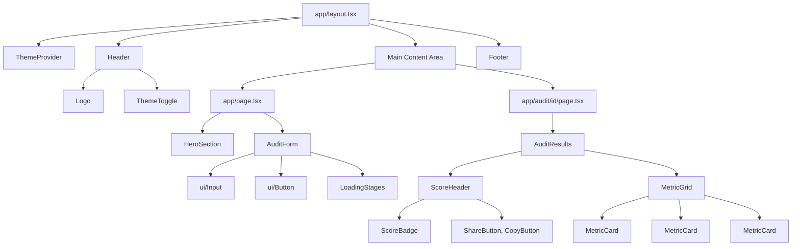
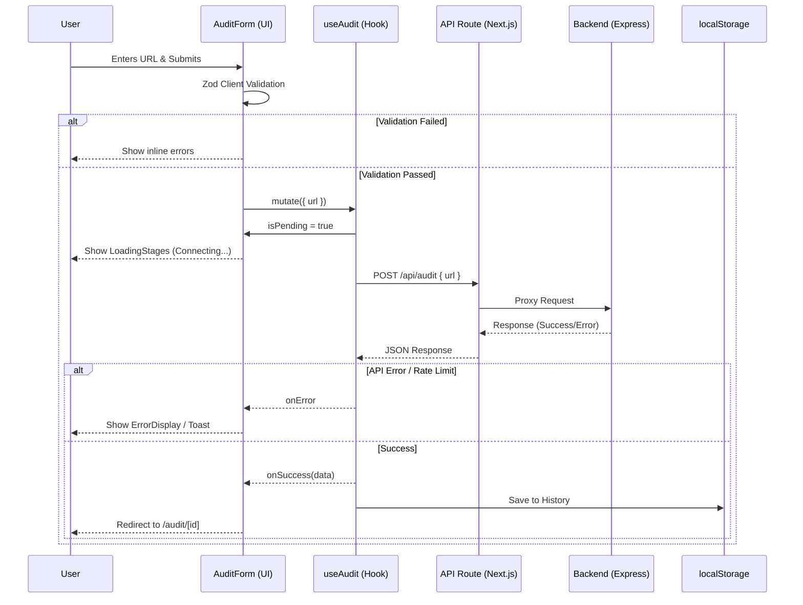

# Frontend Architecture: PagePulse Pro

This document outlines the frontend architecture for the PagePulse Pro web application. The frontend is built using Next.js 15 (App Router), TypeScript, Tailwind CSS, shadcn/ui, React Hook Form, Zod, TanStack Query, and Lucide Icons.

## Directory Structure & Responsibilities

### Pages (App Router)
The `app` directory utilizes the Next.js App Router for routing and rendering.
- `app/page.tsx` — Landing page with the hero section and the primary audit form.
- `app/audit/[id]/page.tsx` — Shareable result page (React Server Component, fetches directly from the backend for optimal SEO and performance).
- `app/layout.tsx` — Root layout containing global providers, font loading, and core metadata.
- `app/loading.tsx` — Global loading fallback displayed during route transitions.
- `app/error.tsx` — Global error boundary to gracefully catch and handle unexpected runtime errors.
- `app/not-found.tsx` — Custom 404 page for unmatched routes.

### Components (Organized by Feature)
Components are organized to promote reusability and feature encapsulation.
- `components/audit/` — Feature-specific components: `AuditForm`, `AuditResults`, `MetricCard`, `MetricGrid`, `LoadingStages`, `ScoreBadge`.
- `components/layout/` — Structural components: `Header`, `Footer`, `Container`, `PageWrapper`.
- `components/ui/` — Reusable primitive components from shadcn/ui: `Button`, `Input`, `Card`, `Badge`, `Skeleton`, `Toast`, `Tooltip`.
- `components/shared/` — Common application components: `Logo`, `ThemeToggle`, `CopyButton`, `ShareButton`, `ErrorDisplay`.

### Services
The service layer handles external communication.
- `services/audit.ts` — API client functions specifically for audit operations (`submitAudit`, `getAuditById`).
- `services/api.ts` — Base fetch wrapper providing centralized error handling, timeout configuration, and default headers.

### Hooks
Custom React hooks encapsulate complex state and side effects.
- `hooks/useAudit.ts` — TanStack Query mutation for submitting new audits and managing the submission state.
- `hooks/useAuditResult.ts` — TanStack Query query for fetching and caching shared audit results.
- `hooks/useAuditHistory.ts` — Manages reading/writing the last 5 audits to `localStorage` for returning users.
- `hooks/useTheme.ts` — Dark/light mode management and preference persistence.

### Utilities
Pure functions for data transformation and business logic.
- `utils/validation.ts` — Client-side Zod schema validation (schemas imported from `@pagepulse/shared-types`).
- `utils/scoring.ts` — Logic mapping numeric metric scores to corresponding semantic colors (e.g., green, yellow, red).
- `utils/formatters.ts` — Functions for number formatting, date formatting, and URL truncation.
- `utils/storage.ts` — Type-safe wrapper around the browser's `localStorage` API.

## State Management
We rely on targeted state management solutions rather than a monolithic global store:
- **Server State**: TanStack Query manages data fetching, caching, synchronization, and deduplication for audit results.
- **UI State**: React's native `useState` and `useReducer` handle local component state (e.g., form inputs, loading stages, modal visibility).
- **Client State**: `localStorage` handles persistent client state (e.g., local audit history, theme preference).
- **Global State**: No external global state library (like Redux or Zustand) is needed due to minimal shared client state.

## API Layer
- **Proxy**: The Next.js API route (`/api/audit`) proxies requests to the backend service. This avoids CORS issues in production and allows secure injection of server-side secrets.
- **Data Fetching**: TanStack Query handles request caching, deduplication, and automatic error retries.
- **Updates**: Optimistic updates are not required as submitting an audit is a one-shot, authoritative operation.

## Loading Strategy
To provide a smooth user experience during potentially long-running audits, we simulate progression through distinct stages:
1. **Connecting** (0-2s)
2. **Downloading** (2-4s)
3. **Parsing** (4-5s)
4. **Analyzing** (5-6s)
5. **Generating** (6-7s)
- This progression is simulated on the client while the actual backend executes a single request.
- Skeleton cards are used as structural placeholders while data is fetching.
- **Progressive Enhancement**: Result pages are Server-Side Rendered (SSR) and function without client-side JavaScript.

## Error Strategy
- **Form Validation**: Displayed inline directly below the corresponding input field using React Hook Form + Zod.
- **API Errors**: Mapped to user-friendly, actionable messages via a centralized error code lookup table.
- **Network Errors**: Trigger a toast notification prompting the user to retry.
- **Unexpected Errors**: Caught by the Next.js error boundary, displaying a fallback UI with a 'Try Again' button.
- **Rate Limiting**: Rate limit errors display a countdown timer indicating when the user can try again.

---

## Diagrams

### Component Hierarchy

### Data Flow

